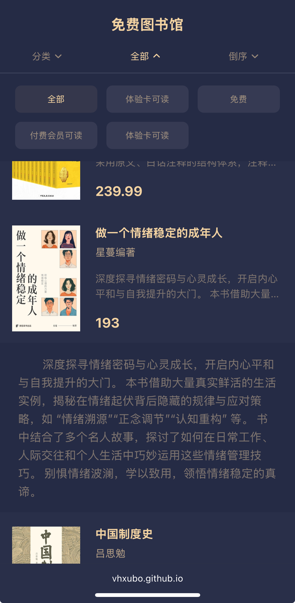

# 免费图书馆

微信读书免费图书馆，数据排序及展示优化。

## 使用方式

1. 自行获取`https://i.weread.qq.com/free/library/list`接口数据；
2. 将数据请求导出为`.json`或者`.txt`文件；
3. 打开[https://vhxubo.github.io/weread-free-library/](https://vhxubo.github.io/weread-free-library/)，点击上传并查看。
